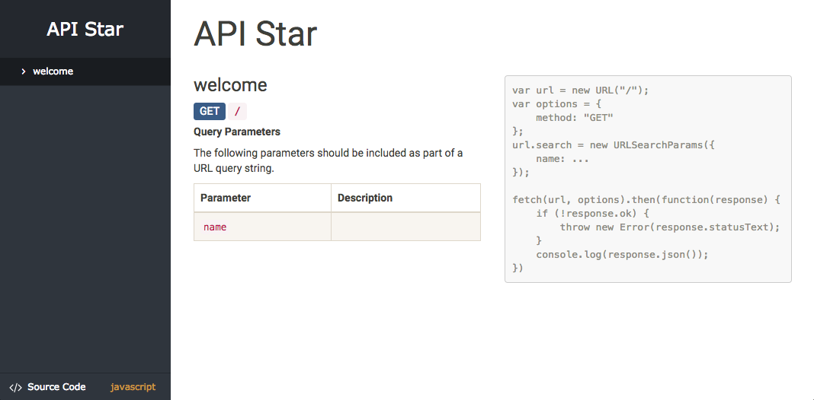

<div style="float: right">
    <a href="https://travis-ci.org/encode/kapi"></a>
    <a href="https://codecov.io/gh/encode/kapi"></a>
    <a href="https://pypi.python.org/pypi/kapi"></a>
</div>

# KAPI

A smart Web API framework, designed for Python 3.

**Repository**: [https://github.com/Cookly/kapi](https://github.com/Cookly/kapi) 💻

---

## Quickstart

Install KAPI:

```bash
$ pip3 install kapi
```

Create a new project in `app.py`:

```python
from kapi import App, Route


def welcome(name=None):
    if name is None:
        return {'message': 'Welcome to KAPI!'}
    return {'message': 'Welcome to KAPI, %s!' % name}


routes = [
    Route('/', method='GET', handler=welcome),
]

app = App(routes=routes)


if __name__ == '__main__':
    app.serve('127.0.0.1', 5000, debug=True)
```

Open `http://127.0.0.1:5000/docs/` in your browser:


